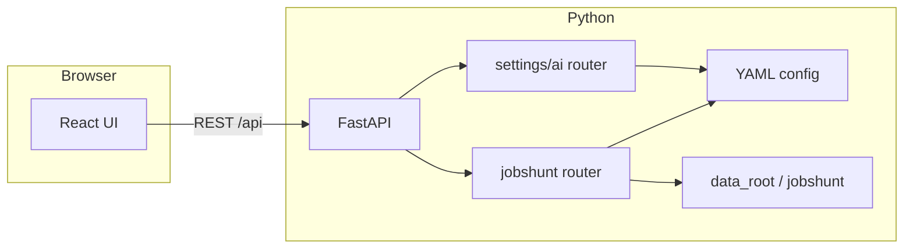

# Architecture

## Overview

JobShunt is a **FastAPI** backend plus a **React (Vite)** single-page UI. State is **local**: YAML config (AI profiles, paths, HTTP bind) and JSON/text files under the **data root** (see `jobshunt.paths`). Config and data default to **`jobshunt`** locations; older **`jobhunt` / `job_hunt`** paths are still read when the new files do not exist.

## Backend packages (`src/jobshunt/`)

| Module | Role |
|--------|------|
| `app.py` | FastAPI app, CORS, static UI mount, health, agent list. |
| `cli.py` | `jobshunt serve`, `config-path`, `data-path`. |
| `config.py` / `models.py` | Load/save `JobShuntAppConfig`; `agent_llm` keys match `KNOWN_AGENTS` (`jobshunt` only). |
| `paths.py` | `config_path()`, `data_root()` with `JOBSHUNT_HOME` / legacy `JOBHUNT_HOME` override. |
| `ai/` | LLM client, OpenAI/Anthropic compatibility, saved profiles, `/api/settings/ai`. |
| `agents/jobshunt/` | Routes under `/api/agents/jobshunt/…`: vault, tailor, pipeline, evaluation, exports, vault summary, scout, **refine-resume**, **apply-insight-items**, **chat**. |
| `agents/jobshunt/text_sanitize.py` | Strips bracketed-paste / OSC noise from pasted job text. |
| `agents/jobshunt/resume_refine.py` | Heuristic + LLM loop to improve ATS-oriented signals. |
| `agents/jobshunt/insight_apply.py` | LLM merge of insight lines into the résumé draft. |
| `agents/jobshunt/jobshunt_chat.py` | Copilot turn + JSON client_actions / server tool execution. |

## Frontend (`ui/`)

Vite builds into `src/jobshunt/static/ui/`. Dev server proxies `/api` to the backend (default port `8765`).

Routes:

- `/agents/jobshunt` — main workspace.
- `/settings/ai` — LLM profiles and per-agent routing (JobShunt only in this repo).

CSS class names prefixed with `portico-` are **legacy** naming from an upstream multi-agent console; they are unrelated to any shipping product named Portico.

## Threat model (local app)

- API keys and paths live in **your** `config.yaml`; keep it out of git.
- Optional Playwright scout runs locally; respect site terms and robots policies.
